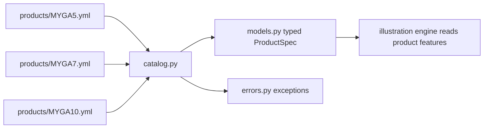

## Step 1B — Product Specs, Models, and Catalog (Developer Structure)

!!! abstract "Purpose of This Step"
    In Step 1A, you created a **policy-level input object** (`IllustrationInputs`).
    In Step 1B, you will create a **product-level configuration layer** so the illustration
    engine can support multiple MYGA products (5/7/10-year) without hardcoding features.

    From a developer perspective, Step 1B introduces a standard architecture:

    - **spec files** (data) → define product features
    - **models.py** (typed schema) → defines how specs are represented in code
    - **catalog.py** (loader + validation) → loads specs into typed objects
    - **errors.py** (clean exceptions) → makes failures readable and debuggable

---

### Why We Split Into 3 Python Files (+ Spec Files)

!!! note "Separation of concerns (this is the whole point)"
    We split the product layer into multiple files so each file has a single responsibility.
    This makes the code easier to test, easier to extend, and safer to refactor.

| Component | What it contains | Why it exists | Who uses it |
|---|---|---|---|
| `products/*.yml` | product configuration data | change products without code changes | catalog loader |
| `models.py` | dataclasses / schema types | typed structure + IDE help | catalog + engine |
| `catalog.py` | file loading + parsing + getters | one place to load/validate products | illustration engine |
| `errors.py` | custom exceptions | clear error handling | catalog + engine |

Think of the flow like this:



---

## Deliverable 1 — Product Spec Files (YAML)

Create these three spec files under `products/`:

| Product | File Name | term_years |
|---|---|---|
| 5-year | `MYGA5.yml` | 5 |
| 7-year | `MYGA7.yml` | 7 |
| 10-year | `MYGA10.yml` | 10 |

All spec files must follow the **same schema structure** so the catalog loader can parse them.

!!! tip
    You only change the **term_years** and **surrender_charge.schedule** across the 3 products for now.
    Everything else can stay consistent unless your product design differs.

---

## Deliverable 2 — `models.py` (Typed Schema)

### What This Step Does

`models.py` defines the **typed representation** of product specs.

This gives you:

- consistent and explicit structure (`ProductSpec → ProductFeatures → ...`)
- type checking and IDE autocompletion
- a single “source of truth” for what fields exist in a product spec

### What You Are Expected to Build

You should create `models.py` with:

- feature-level dataclasses (MVA, surrender charge, free withdrawals, guarantee funds)
- top-level dataclasses (`ProductFeatures`, `ProductSpec`)
- limited `Literal[...]` values to enforce allowed options

### Starter Code (Students Build From This)

```python
from __future__ import annotations

from dataclasses import dataclass
from typing import Dict, Optional, Literal


# -----------------------
# Enumerations
# -----------------------
FreeWithdrawalMethod = Literal[
    "prior_year_interest_credited",
    "pct_of_boy_account_value",
]


# -----------------------
# Feature dataclasses
# -----------------------
@dataclass(frozen=True)
class BenchmarkIndex:
    type: str
    code: str
    description: str = ""


@dataclass(frozen=True)
class MVAFeature:
    enabled: bool
    benchmark_index: Optional[BenchmarkIndex] = None


@dataclass(frozen=True)
class SurrenderChargeFeature:
    schedule: Dict[int, float]              # policy_year -> pct
    after_term_default_charge_pct: float    # e.g., 0.0


@dataclass(frozen=True)
class FreePartialWithdrawalFeature:
    enabled: bool
    method: FreeWithdrawalMethod
    params: Dict[str, float]                # e.g., {"pct": 0.10}
    description: str = ""


# -----------------------
# Guarantee fund specs
# -----------------------
@dataclass(frozen=True)
class MFVSpec:
    base_pct_of_premium: float  # e.g. 0.875


@dataclass(frozen=True)
class PFVSpec:
    base_pct_of_premium: float
    rate_annual: float
    rate_years: int
    rate_after_years_annual: float


@dataclass(frozen=True)
class GuaranteeFundsSpec:
    mfv: MFVSpec
    pfv: PFVSpec


# -----------------------
# Product Spec
# -----------------------
@dataclass(frozen=True)
class ProductFeatures:
    minimum_guaranteed_rate: float
    mva: MVAFeature
    surrender_charge: SurrenderChargeFeature
    free_partial_withdrawal: FreePartialWithdrawalFeature
    guarantee_funds: GuaranteeFundsSpec


@dataclass(frozen=True)
class ProductSpec:
    schema_version: int
    product_code: str
    term_years: int
    features: ProductFeatures

    # Assumption keys (placeholders for future builds)
    mortality_table_key: Optional[str] = None
    lapse_model_key: Optional[str] = None
    withdrawal_behavior_key: Optional[str] = None
    expense_assumption_key: Optional[str] = None
```

---

## Deliverable 3 — `catalog.py` (Load + Validate + Getters)

### What This Step Does

`catalog.py` is responsible for:

- loading a product spec file by product code
- parsing raw YAML into typed `ProductSpec`
- validating required fields and allowed values
- providing helper getters for the illustration engine

This prevents the engine from needing to read YAML directly.

### What You Are Expected to Build

Minimum catalog behaviors:

| Behavior | Requirement |
|---|---|
| Load | load `products/{CODE}.yml` |
| Cache | keep loaded products in memory |
| Validate | raise readable errors for missing fields |
| Parse | convert to typed `ProductSpec` |
| Getters | term_years, surrender_charge, free withdrawal method, etc. |

### Starter Code (Reduced — Do Not Copy Full Production Code)

```python
from __future__ import annotations

from pathlib import Path
from typing import Dict, List, Optional

import yaml

from .errors import ProductNotFoundError, ProductSpecValidationError
from .models import (
    BenchmarkIndex,
    FreePartialWithdrawalFeature,
    MVAFeature,
    ProductFeatures,
    ProductSpec,
    SurrenderChargeFeature,
    MFVSpec,
    PFVSpec,
    GuaranteeFundsSpec,
)


class ProductCatalog:
    def __init__(self, products_dir: Path):
        self.products_dir = products_dir
        self._cache: Dict[str, ProductSpec] = {}

    def list_products(self) -> List[str]:
        return sorted([p.stem.upper() for p in self.products_dir.glob("*.yml")])

    def get(self, product_code: str) -> ProductSpec:
        code = product_code.strip().upper()
        if code in self._cache:
            return self._cache[code]

        path = self.products_dir / f"{code}.yml"
        if not path.exists():
            raise ProductNotFoundError(f"Product '{code}' not found: {path}")

        raw = yaml.safe_load(path.read_text())
        spec = self._parse_spec(raw)
        self._cache[code] = spec
        return spec

    def term_years(self, product_code: str) -> int:
        return self.get(product_code).term_years

    def surrender_charge(self, product_code: str, policy_year: int) -> float:
        spec = self.get(product_code)
        sched = spec.features.surrender_charge.schedule
        if policy_year <= spec.term_years:
            if policy_year not in sched:
                raise ProductSpecValidationError(
                    f"{product_code}: missing surrender charge for year {policy_year}"
                )
            return float(sched[policy_year])
        return float(spec.features.surrender_charge.after_term_default_charge_pct)

    def _parse_spec(self, raw: dict) -> ProductSpec:
        # Minimal parse skeleton (students should expand + validate)
        try:
            product_code = str(raw["product_code"]).upper()
            term_years = int(raw["term_years"])
            schema_version = int(raw["schema_version"])

            f = raw["features"]

            # MVA
            mva_raw = f["mva"]
            bi = mva_raw.get("benchmark_index")
            benchmark_index = None if bi is None else BenchmarkIndex(
                type=str(bi.get("type", "")),
                code=str(bi.get("code", "")),
                description=str(bi.get("description", "")),
            )
            mva = MVAFeature(enabled=bool(mva_raw["enabled"]), benchmark_index=benchmark_index)

            # Surrender charge
            sc_raw = f["surrender_charge"]
            schedule = {int(k): float(v) for k, v in sc_raw["schedule"].items()}
            after_term_default = float(sc_raw["after_term"]["default_charge_pct"])
            surrender_charge = SurrenderChargeFeature(
                schedule=schedule,
                after_term_default_charge_pct=after_term_default,
            )

            # Free partial withdrawal
            fpw_raw = f["free_partial_withdrawal"]
            method = str(fpw_raw["method"])
            params = {str(k): float(v) for k, v in (fpw_raw.get("params") or {}).items()}
            free_partial_withdrawal = FreePartialWithdrawalFeature(
                enabled=bool(fpw_raw.get("enabled", True)),
                method=method,  # type: ignore
                params=params,
                description=str(fpw_raw.get("description", "")),
            )

            # Guarantee funds
            gf_raw = f["guarantee_funds"]
            mfv = MFVSpec(base_pct_of_premium=float(gf_raw["mfv"]["base_pct_of_premium"]))
            pfv = PFVSpec(
                base_pct_of_premium=float(gf_raw["pfv"]["base_pct_of_premium"]),
                rate_annual=float(gf_raw["pfv"]["rate_annual"]),
                rate_years=int(gf_raw["pfv"]["rate_years"]),
                rate_after_years_annual=float(gf_raw["pfv"]["rate_after_years_annual"]),
            )
            guarantee_funds = GuaranteeFundsSpec(mfv=mfv, pfv=pfv)

            features = ProductFeatures(
                minimum_guaranteed_rate=float(f["minimum_guaranteed_rate"]),
                mva=mva,
                surrender_charge=surrender_charge,
                free_partial_withdrawal=free_partial_withdrawal,
                guarantee_funds=guarantee_funds,
            )

            a = raw.get("assumptions", {}) or {}

            return ProductSpec(
                schema_version=schema_version,
                product_code=product_code,
                term_years=term_years,
                features=features,
                mortality_table_key=a.get("mortality_table_key"),
                lapse_model_key=a.get("lapse_model_key"),
                withdrawal_behavior_key=a.get("withdrawal_behavior_key"),
                expense_assumption_key=a.get("expense_assumption_key"),
            )

        except KeyError as e:
            raise ProductSpecValidationError(f"Missing required field: {e}") from e
        except ValueError as e:
            raise ProductSpecValidationError(f"Invalid value type: {e}") from e
```

---

## Additional Challenge — `errors.py` (Custom Exceptions)

### Why We Need This

Without custom errors, Python will throw generic exceptions that are hard for students to debug.

Custom exceptions make failures:

- more readable
- easier to test
- consistent across the project

### What You Are Expected to Build

Create an `errors.py` with these classes:

| Class | Purpose |
|---|---|
| `ProductCatalogError` | base error |
| `ProductNotFoundError` | missing product file |
| `ProductSpecValidationError` | bad YAML structure or invalid values |

### Starter Code

```python
class ProductCatalogError(Exception):
    """Base exception for product catalog errors."""


class ProductNotFoundError(ProductCatalogError):
    """Raised when a product spec file cannot be found."""


class ProductSpecValidationError(ProductCatalogError):
    """Raised when a product spec file exists but fails validation."""
```

---

## Step 1B Deliverable Checklist

You should have:

1. `products/` directory with:
   - `MYGA5.yml`
   - `MYGA7.yml`
   - `MYGA10.yml`

2. `models.py` with typed dataclasses:
   - `ProductSpec` and feature specs

3. `catalog.py` with:
   - loading + caching
   - parsing YAML into typed objects
   - basic validation
   - convenience getters

4. `errors.py` with:
   - `ProductNotFoundError`
   - `ProductSpecValidationError`

---

## Quick Self-Test

```python
from pathlib import Path
from your_package.catalog import ProductCatalog

catalog = ProductCatalog(Path("products"))

print(catalog.list_products())
print(catalog.term_years("MYGA5"))
print(catalog.surrender_charge("MYGA5", 1))
print(catalog.surrender_charge("MYGA5", 10))  # should use after-term default
```

If this runs cleanly, your product layer is ready for the illustration engine.